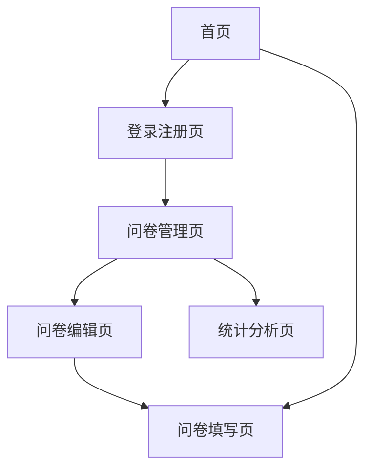

# 问卷调查网站产品需求文档

## 1. 产品概述

本产品是一个在线问卷调查平台，用户可以创建、发布、填写问卷，并查看统计结果。
- 解决传统纸质问卷效率低、统计困难的问题，为个人、企业、学术机构提供便捷的数据收集工具。
- 目标是成为简单易用、功能完善的问卷调查解决方案，提升数据收集和分析效率。

## 2. 核心功能

### 2.1 用户角色

| 角色 | 注册方式 | 核心权限 |
|------|----------|----------|
| 普通用户 | 邮箱注册 | 可创建问卷、填写问卷、查看自己的问卷统计 |
| 访客用户 | 无需注册 | 仅可填写公开问卷 |

### 2.2 功能模块

我们的问卷调查网站包含以下主要页面：
1. **首页**：产品介绍、功能展示、问卷模板展示
2. **登录注册页**：用户登录、注册、密码重置
3. **问卷管理页**：我的问卷列表、创建新问卷、编辑问卷
4. **问卷编辑页**：问卷标题设置、题目添加编辑、发布设置
5. **问卷填写页**：问卷展示、答题、提交
6. **统计分析页**：问卷回收统计、数据图表展示、结果导出

### 2.3 页面详情

| 页面名称 | 模块名称 | 功能描述 |
|----------|----------|----------|
| 首页 | 导航栏 | 显示网站logo、登录注册入口、主要功能导航 |
| 首页 | 产品介绍区 | 展示产品核心价值、使用流程说明 |
| 首页 | 模板展示区 | 展示热门问卷模板，支持预览和使用 |
| 登录注册页 | 登录表单 | 邮箱密码登录、记住登录状态、忘记密码链接 |
| 登录注册页 | 注册表单 | 邮箱注册、密码设置、邮箱验证 |
| 问卷管理页 | 问卷列表 | 显示我的问卷、状态筛选、搜索、删除操作 |
| 问卷管理页 | 创建入口 | 新建问卷按钮、选择模板创建 |
| 问卷编辑页 | 基本信息设置 | 问卷标题、描述、封面图片设置 |
| 问卷编辑页 | 题目编辑器 | 添加单选、多选、填空、量表等题型 |
| 问卷编辑页 | 发布设置 | 设置问卷状态、访问权限、截止时间 |
| 问卷填写页 | 问卷展示 | 显示问卷信息、题目列表、进度条 |
| 问卷填写页 | 答题区域 | 支持各种题型作答、必填验证、提交确认 |
| 统计分析页 | 数据概览 | 显示回收数量、完成率、平均用时 |
| 统计分析页 | 图表分析 | 各题目统计图表、交叉分析、数据导出 |

## 3. 核心流程

**普通用户流程：**
用户注册登录 → 创建问卷 → 编辑问卷内容 → 发布问卷 → 分享问卷链接 → 查看统计结果

**访客用户流程：**
访问问卷链接 → 填写问卷 → 提交问卷

## 4. 用户界面设计

### 4.1 设计风格

- 主色调：蓝色系（#2563eb）和白色（#ffffff）
- 辅助色：灰色系（#6b7280）和绿色（#10b981）
- 按钮样式：圆角按钮，悬停效果
- 字体：系统默认字体，标题16-24px，正文14-16px
- 布局风格：卡片式设计，顶部导航栏
- 图标风格：简洁线性图标，支持主题色填充

### 4.2 页面设计概览

| 页面名称 | 模块名称 | UI元素 |
|----------|----------|--------|
| 首页 | 导航栏 | 白色背景，蓝色logo，右侧登录按钮，固定顶部 |
| 首页 | 产品介绍区 | 大标题+副标题，配图展示，渐变背景 |
| 首页 | 模板展示区 | 卡片网格布局，悬停放大效果，标签分类 |
| 登录注册页 | 表单区域 | 居中卡片布局，输入框圆角设计，蓝色提交按钮 |
| 问卷管理页 | 问卷列表 | 表格布局，状态标签，操作按钮组 |
| 问卷编辑页 | 编辑器 | 左侧题型工具栏，中间编辑区，右侧预览 |
| 问卷填写页 | 答题区域 | 简洁表单设计，进度条，底部提交按钮 |
| 统计分析页 | 图表区域 | 卡片式图表布局，多色数据可视化 |

### 4.3 响应式设计

采用移动端优先的响应式设计，支持桌面端和移动端访问，针对触屏操作进行优化。