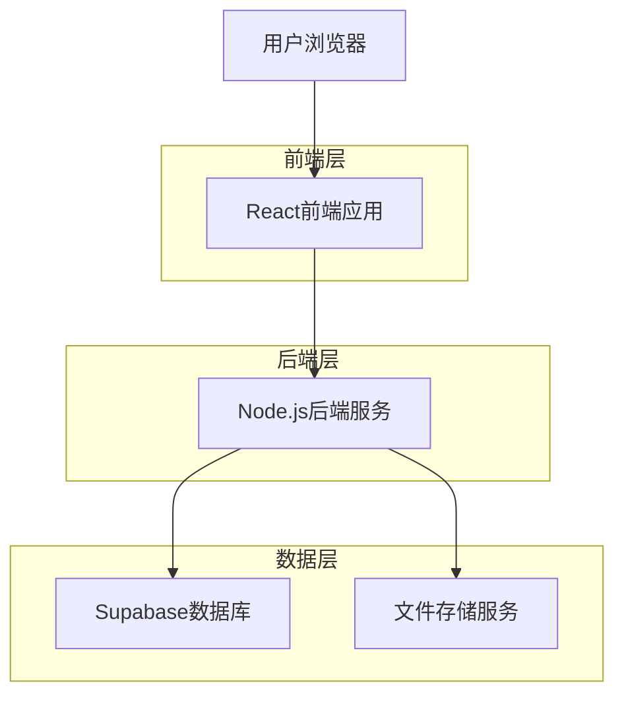
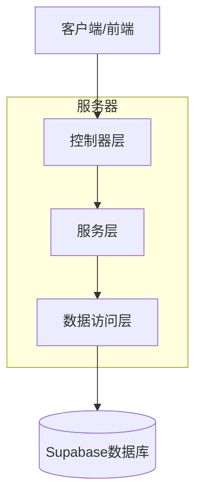
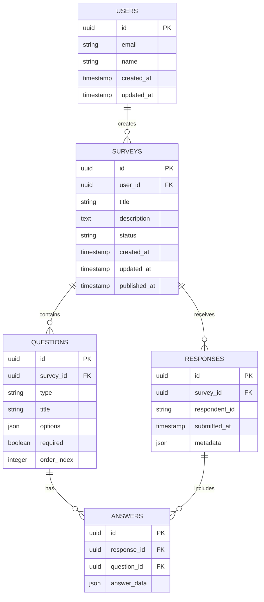

# 问卷调查网站技术架构文档

## 1. 架构设计



## 2. 技术描述

- 前端：React@18 + TypeScript@5 + Vite + TailwindCSS@3
- 后端：Node.js@18 + Express@4 + TypeScript@5
- 数据库：Supabase (PostgreSQL)
- 认证：Supabase Auth
- 部署：Vercel (前端) + Railway (后端)

## 3. 路由定义

| 路由 | 用途 |
|------|------|
| / | 首页，展示产品介绍和功能特色 |
| /login | 登录页面，用户身份验证 |
| /register | 注册页面，新用户注册 |
| /dashboard | 问卷管理页面，显示用户的问卷列表 |
| /survey/create | 问卷创建页面，创建新问卷 |
| /survey/edit/:id | 问卷编辑页面，编辑指定问卷 |
| /survey/:id | 问卷填写页面，用户填写问卷 |
| /survey/:id/results | 统计分析页面，查看问卷统计结果 |

## 4. API定义

### 4.1 核心API

用户认证相关
```
POST /api/auth/register
```

请求参数：
| 参数名 | 参数类型 | 是否必填 | 描述 |
|--------|----------|----------|------|
| email | string | true | 用户邮箱 |
| password | string | true | 用户密码 |
| name | string | true | 用户姓名 |

响应参数：
| 参数名 | 参数类型 | 描述 |
|--------|----------|------|
| success | boolean | 注册是否成功 |
| user | object | 用户信息 |
| token | string | 认证令牌 |

问卷管理相关
```
GET /api/surveys
POST /api/surveys
PUT /api/surveys/:id
DELETE /api/surveys/:id
GET /api/surveys/:id/responses
```

问卷回答相关
```
POST /api/surveys/:id/submit
GET /api/surveys/:id/stats
```

## 5. 服务器架构图



## 6. 数据模型

### 6.1 数据模型定义



### 6.2 数据定义语言

用户表 (users)
```sql
-- 创建用户表
CREATE TABLE users (
    id UUID PRIMARY KEY DEFAULT gen_random_uuid(),
    email VARCHAR(255) UNIQUE NOT NULL,
    name VARCHAR(100) NOT NULL,
    created_at TIMESTAMP WITH TIME ZONE DEFAULT NOW(),
    updated_at TIMESTAMP WITH TIME ZONE DEFAULT NOW()
);

-- 创建索引
CREATE INDEX idx_users_email ON users(email);
```

问卷表 (surveys)
```sql
-- 创建问卷表
CREATE TABLE surveys (
    id UUID PRIMARY KEY DEFAULT gen_random_uuid(),
    user_id UUID NOT NULL,
    title VARCHAR(255) NOT NULL,
    description TEXT,
    status VARCHAR(20) DEFAULT 'draft' CHECK (status IN ('draft', 'published', 'closed')),
    created_at TIMESTAMP WITH TIME ZONE DEFAULT NOW(),
    updated_at TIMESTAMP WITH TIME ZONE DEFAULT NOW(),
    published_at TIMESTAMP WITH TIME ZONE
);

-- 创建索引
CREATE INDEX idx_surveys_user_id ON surveys(user_id);
CREATE INDEX idx_surveys_status ON surveys(status);
```

问题表 (questions)
```sql
-- 创建问题表
CREATE TABLE questions (
    id UUID PRIMARY KEY DEFAULT gen_random_uuid(),
    survey_id UUID NOT NULL,
    type VARCHAR(50) NOT NULL CHECK (type IN ('single_choice', 'multiple_choice', 'text', 'rating')),
    title TEXT NOT NULL,
    options JSON,
    required BOOLEAN DEFAULT false,
    order_index INTEGER NOT NULL
);

-- 创建索引
CREATE INDEX idx_questions_survey_id ON questions(survey_id);
CREATE INDEX idx_questions_order ON questions(survey_id, order_index);
```

回答表 (responses)
```sql
-- 创建回答表
CREATE TABLE responses (
    id UUID PRIMARY KEY DEFAULT gen_random_uuid(),
    survey_id UUID NOT NULL,
    respondent_id VARCHAR(255),
    submitted_at TIMESTAMP WITH TIME ZONE DEFAULT NOW(),
    metadata JSON
);

-- 创建索引
CREATE INDEX idx_responses_survey_id ON responses(survey_id);
CREATE INDEX idx_responses_submitted_at ON responses(submitted_at DESC);
```

答案表 (answers)
```sql
-- 创建答案表
CREATE TABLE answers (
    id UUID PRIMARY KEY DEFAULT gen_random_uuid(),
    response_id UUID NOT NULL,
    question_id UUID NOT NULL,
    answer_data JSON NOT NULL
);

-- 创建索引
CREATE INDEX idx_answers_response_id ON answers(response_id);
CREATE INDEX idx_answers_question_id ON answers(question_id);

-- 设置权限
GRANT SELECT ON surveys TO anon;
GRANT SELECT ON questions TO anon;
GRANT INSERT ON responses TO anon;
GRANT INSERT ON answers TO anon;

GRANT ALL PRIVILEGES ON users TO authenticated;
GRANT ALL PRIVILEGES ON surveys TO authenticated;
GRANT ALL PRIVILEGES ON questions TO authenticated;
GRANT ALL PRIVILEGES ON responses TO authenticated;
GRANT ALL PRIVILEGES ON answers TO authenticated;
```